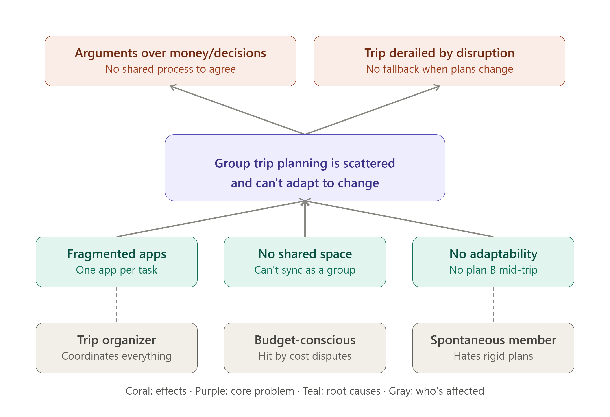
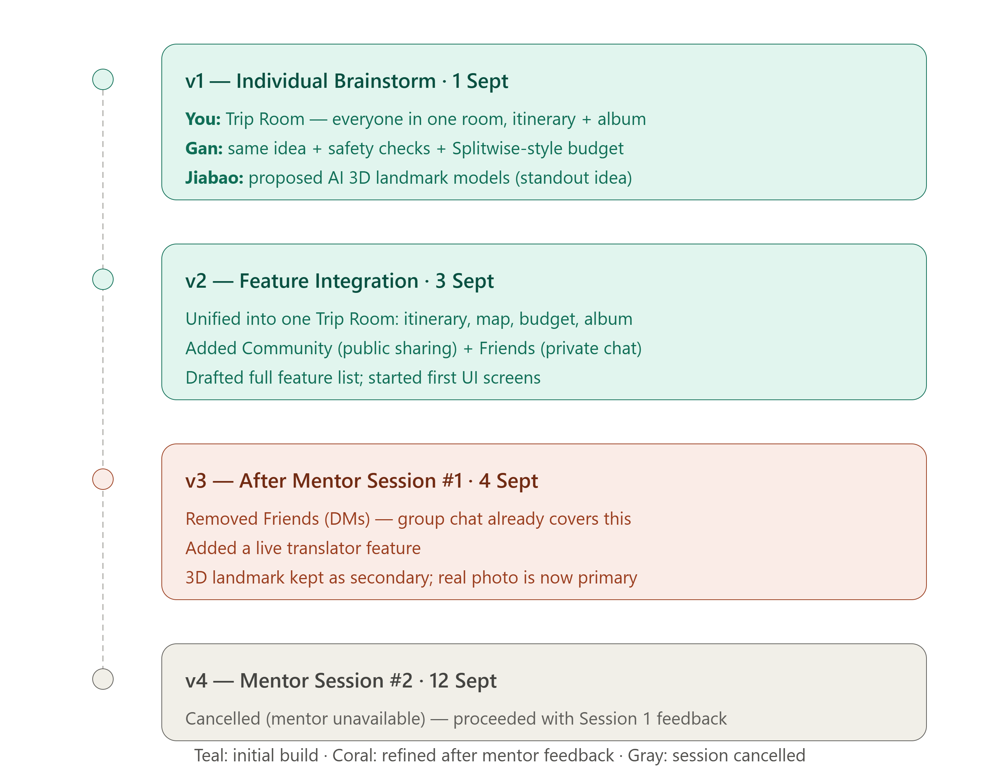

<div align="center">

# 🧭 ReRoute
### by The Avengers

### *The trip room that plans with you, travels with you, and never leaves you stranded.*

[](https://itsocietymmu.com/codenection-2026)
[]()
[]()
[]()

**Team:** Lee Zhen Jie (Team Leader) · Gan Rui En · Hong Jia Bao
**Problem Statement:** Travel Planner
**Video Presentation:** [[Video](https://youtu.be/qEgKrmR7KVY?si=w5rek1cmsGN-q1Yn)]
**Presentation Slides:** [[Slide](https://docs.google.com/presentation/d/1NqwCnODBXK5m56SYaAdT2FiDY0JwNde8/edit?usp=sharing&ouid=106631640333214814428&rtpof=true&sd=true)]
**UI Prototype:** [[Link](https://reroute2026.netlify.app/)]

</div>

---

## 1. Project Overview

### The Problem

Planning a group trip means juggling flights, budgets, itineraries, and everyone's clashing preferences across multiple single-purpose apps and a group chat. Stakeholders, the trip organizer, budget-conscious members, and spontaneous members, each feel this differently: the organizer carries the coordination load, budget-conscious members get hit hardest by cost disputes, and spontaneous members are frustrated when nothing adapts. The moment plans change mid-trip, existing tools go silent.

Apps like **TripIt** organize itineraries well but stop there, they don't handle group budgeting, decision-making, or what happens when a flight gets delayed. Travelers are left stitching multiple apps together themselves.

### Our Solution

ReRoute gives every trip a dedicated **Trip Room**, one shared space that plans the trip with AI, mediates group decisions, adapts in real time when plans break, splits the bill, and remembers the trip once it's over. Instead of treating "the group disagrees" and "the plan broke" as separate problems, ReRoute resolves both through the same in-chat decision-card mechanism.

**Feature set:**
- 🗺️ AI route planning with live rerouting and safety/news risk alerts
- 🏔️ Landmark exploration, real photo primary, AI-generated 3D model as a secondary preview
- 🏠 Trip Rooms, anonymous voting, comments, group chat, opt-in live location sharing
- 💸 Splitwise-style expense splitting with AI receipt scanning
- 🤖 AI-suggested itineraries from aggregate traveler behavior
- 🆘 Emergency SOS with local emergency number lookup
- 🗣️ Destination language mini-lessons plus a live translator
- 📸 Shared, auto-organized trip album
- 👤 Profile with trip history and badges

---

## 2. Ideation & Process

### 2.1 Ideas We Considered

| Idea | Why it was kept / dropped |
|---|---|
| **Trip Room concept** (Chosen) | Everyone in one shared room per trip, with itinerary and album inside, became the core structure everything else attaches to |
| **Safety checks + Splitwise-style budget** (Chosen) | Extended the Trip Room idea to solve the "who owes who" problem directly, plus proactive risk awareness |
| **AI-generated 3D landmark models** (Chosen, repositioned) | A standout, memorable differentiator is kept, but demoted to a secondary preview after mentor feedback (see 2.3) |
| **Community (public trip sharing) + Friends (private DMs)** (Dropped) | Initially added to let users share trips and message each other directly. Dropped after mentor feedback, personal DMs felt inconsistent with a trip-planning app that already has group chat built into every Trip Room |

### 2.2 Ideation Boards


*A problem tree showing the root causes of scattered group trip planning, the core problem, and who is affected most, the organizer, the budget-conscious member, and the spontaneous member.*


*Our idea evolution from individual brainstorming (1 Sept) through feature integration (3 Sept) to refinement after mentor feedback (4 Sept).*

### 2.3 Mentor Consultation

| Date | Mentor | Feedback Received | What Was Changed |
|---|---|---|---|
| 4 Sept 2026 | Lim Zi Yang | Personal DM-style chat felt out of place in a trip-planning app since every Trip Room already has group chat; as a user, real photos of a landmark would be preferred over a 3D model | Removed Community and Friends (private DMs) entirely; kept the 3D landmark model but made it a secondary view, with a real photo as the primary image; added a live translator feature based on the same discussion |
| 12 Sept 2026 | Mah Qing Fung | Session was cancelled — mentor was unavailable | No changes made for this session; proceeded with the plan refined after Session 1 |

> Even where we didn't get to test further ideas with a mentor before submission, we've noted the cancellation transparently rather than skip this section.

---

## 3. Design & Prototype

**UI Prototype:** [Your deployed link — add once you have it]

*(Confirmed to open correctly in an incognito window.)*

Initially prototyped in Stitch and Figma using a shared `Design.md` design system (seasonal color themes, consistent typography, reusable components for navigation, cards, buttons, and badges). We then translated the design into actual React Native (Expo) code to give the Building Phase a head start, the linked prototype is a web export of this working app, not a static click-through, so screens are real components rather than static images.

Key screens: Auth, Home (AI trip chatbox), Trip Room (Discussion / Budget / Album / Map tabs), Languages, Profile.

---

## 4. What Makes It Different

- **One mechanism, two triggers.** Most travel apps treat group conflict and mid-trip disruption as separate problems needing separate features. ReRoute resolves both through the same decision-card system, whichever one triggers it, the group sees options and votes the same way.
- **Photo-first landmark exploration.** Based on direct mentor feedback, real photos are the primary way to explore a landmark, with an AI-generated 3D model available as a secondary, playful extra, prioritizing what users actually want to see first.
- **Trip-scoped, not social-network-scoped.** We deliberately removed general social features (public feeds, private DMs) that didn't serve the actual travel-planning use case, keeping the app focused on what a trip group needs.

| | ReRoute | TripIt | Splitwise |
|---|---|---|---|
| Itinerary planning | ✅ AI-generated, adaptable | ✅ Manual/import-based | ❌ |
| Group expense splitting | ✅ Built-in, with OCR receipt scan | ❌ | ✅ |
| Mid-trip disruption handling | ✅ | ❌ | ❌ |
| Group decision mediation | ✅ Anonymous voting | ❌ | ❌ |

---

## 5. Technical Architecture & Feasibility

### Tech Stack

| Layer | Choice | Why |
|---|---|---|
| Frontend | React Native (Expo) | Native performance, fastest path to a smooth cross-platform prototype |
| Backend | Supabase (Postgres + PostGIS, Auth, Realtime, Storage) | Team already familiar with it; PostGIS fits our location-heavy features (live location, routes) |
| Maps | Google Maps API | Reliable directions/places data |
| AI | Claude / OpenAI API | Powers itinerary generation, safety-check summarization, and receipt OCR |

**Constraints we expect:** Supabase's free tier has usage limits we may need to monitor if the app grows past prototype scale; live location sharing depends on device GPS permissions, which we handle as opt-in per user.

### Build Plan & Scope

For the Building Phase, we plan to fully implement one end-to-end flow rather than all features shallowly: sign up → create a Trip Room → generate an AI itinerary → a disruption occurs → group votes via a decision card → an expense is logged via receipt scan → settle up → view the shared album. Remaining features (Community/Friends were already cut; language learning, SOS, and the recommendation engine) are scoped as documented in `docs/feature-requirements.md`, with clear notes on what's real vs. mocked for demo purposes.

---

## 📂 Repo Structure

```
reroute/
├── README.md
├── docs/
│   ├── feature-requirements.md
│   └── Design.md
├── ideation/
│   ├── reroute_problem_tree.png
│   └── reroute_idea_evolution.png
├── frontend/
│   └── ...                       # React Native (Expo) app — prototype code
└── backend/
    └── README.md                 # scaffolded folder; implementation begins in the Building Phase
```

---

## 🙏 Acknowledgments

Built for **CodeNection 2026**, organized by **IT Society MMU**, co-organized by **Meta-Learning**, and sponsored by **Cyberview** and **Printcious**.

<div align="center">

*Made with 🧭 and too little sleep.*

</div>
