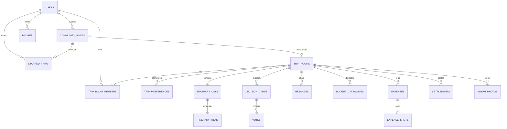

# ReRoute — UI Requirements Specification (v1.0)

*CodeNection 2026 — Lifestyle Track: Planning an Escape*  
**Document Status:** Approved Baseline  
**Target Platform:** React Native (Expo) Mobile Application  
**Backend:** Supabase (Postgres + PostGIS, Auth, Realtime, Storage)  
**Related Specs:** `DESIGN.md` (Design Tokens & Styles), `SCREEN_SPEC.md` (Figma Layout Specifications), `ReRoute_Requirements_Refined_v2_2.md` (System Requirements)

---

## 1. Document Overview & Scope

### 1.1 Purpose
This document specifies the comprehensive functional, visual, and behavioral UI requirements for the **ReRoute** mobile application. It acts as the primary contract between Product Management, UI/UX Design (Figma), and Frontend Engineering (React Native / Expo).

### 1.2 Design & Architecture Principles
- **Mobile-First Experience:** Restricted to mobile viewports (`max-w-md` / 448px container width), native touch interactions, and standard iOS/Android safe area accommodations.
- **Presentation Separation:** This document specifies **what** each screen and widget must do, their state machines, required fields, and acceptance criteria. Exact visual tokens (hex colors, typography scales, pixel paddings) are governed by `DESIGN.md`, while exact layout compositions are specified in `SCREEN_SPEC.md`.
- **Hackathon-Ready Pragmatism:** Optimized for demo impact, zero-latency feedback, clear error boundaries, and robust handling of real-time multi-user features.

### 1.3 Scope Reconciliations (v2.2 Alignment)
1. **Friends Feature Dropped:** Friendship lists, friend requests, friend chat, and friend-scoped filters are **fully removed** across all screens, models, and notifications.
2. **Public-Only Discover Feed:** Discover displays public recap and cloneable posts only. Interactions are strictly restricted to **Starring (Saving)**. No comment or like interfaces exist.
3. **Outbound Booking & Ticket Links:** Modular suggestions and itinerary items for Accommodation and Transportation include outbound external link-outs (`itinerary_items.booking_url`) without in-app booking/payment flows.
4. **Personalized Recent News:** The Home safety and news feed only surfaces alerts matching destinations present in the user's active or planning trip rooms (`FR-NAV-6`).
5. **Single Live Trip Routing:** When a user has an active trip (`is_live_for_user = true`), selecting the Trip tab bypasses the room selection hub and navigates directly to the active Trip Room.
6. **App Mascot as Presentation Layer:** The Mascot is not a destination screen; it is a persona delivering notifications, chat messages, and contextual alerts.

---

## 2. Global Navigation & Persistent Widgets

### 2.1 Top Navigation Bar
- **Purpose:** Provide persistent brand presence, user identity access, seasonal theme indication, and instant access to system-wide notifications on every authenticated screen.
- **Required UI Sections:**
  - *Left Area:* User Avatar icon (tapping navigates to Profile).
  - *Center/Accent Area:* Season indicator / Theme pill (displays current season accent color: Spring `#FEB1C6`, Summer `#697E50`, Autumn `#FB8C00`, Winter `#C9DEEF`).
  - *Right Area:* Notification Bell icon with an unread indicator dot (badge count).
- **Required Fields:**
  - `users.avatar` (URL string or fallback initials)
  - `safety_alerts`, `decision_cards`, `messages` (count of unread/actionable items)
- **User Actions:**
  - Tap Avatar → Navigate to Profile tab (`FR-NAV-1`).
  - Tap Notification Bell → Open Notification Center drawer/modal (`FR-9-1`).
  - Tap Theme Indicator → Displays active destination weather/season mood (Open Item: manual toggle vs informational indicator).
- **States:**
  - *Default:* Clean glassmorphic bar (`bg-background/80`, `backdrop-blur-xl`).
  - *Unread Alerts:* Red/Orange dot overlaid on the top-right of the bell icon.
- **Acceptance Criteria:** `FR-NAV-1`, `FR-2-3`, `FR-9-1`.

---

### 2.2 Notification Center (Modal / Bottom Sheet)
- **Purpose:** Centralized hub for incoming system notifications, mascot-delivered advisories, safety/weather alerts, voting requests, and emergency broadcast logs.
- **Required UI Sections:**
  - *Header:* Title ("Notifications"), "Mark all as read" button, Dismiss/Close button.
  - *Category Filter Pills:* "All", "Safety & Weather", "Decisions & Votes", "Mascot Tips".
  - *Notification List:* Chronological feed of notification cards.
- **Required Fields:**
  - Notification type (`safety_risk`, `decision_card`, `mascot_advisory`, `sos_alert`, `budget_alert`)
  - Timestamp (`created_at`)
  - Title, Summary text, Target deep-link payload (`room_id`, `alert_id`, `card_id`)
  - Read/Unread status (`is_read`)
- **User Actions:**
  - Tap Notification Card → Mark as read and deep-link directly to the corresponding surface (e.g. Safety Alert Detail, Trip Room Chat at the Decision Card, Budget Dashboard).
  - Swipe to Dismiss / Clear notification.
- **States:**
  - *Empty State:* "You're all caught up! No active alerts." with a resting mascot illustration.
  - *Loading State:* Skeleton placeholder cards.
- **Acceptance Criteria:** `FR-1-9`, `FR-4-2`, `FR-9-1`, `FR-9-2`, `FR-9-3`.

---

### 2.3 Global SOS Floating Overlay & Quick-Dial
- **Purpose:** Provide life-safety emergency signaling and instant local authority dialing persistently accessible across all 3 bottom tabs whenever a trip is currently live.
- **Required UI Sections:**
  - *Persistent SOS FAB:* Prominent squircle floating action button (`h-16 w-16 rounded-2xl`, `bg-destructive`), fixed at the bottom-right above the navigation bar.
  - *SOS Confirmation Dialog (2-Step Safety Gate):* Prevents accidental emergency triggers. Displays "Trigger Emergency SOS?", destination name, and a 3-second hold-to-activate or slide-to-confirm button.
  - *Quick-Dial & Broadcast Modal:*
    - Emergency broadcast confirmation: "Alert and current GPS dispatched to all room members."
    - Local Emergency Service button: Pre-filled with country-specific emergency number (e.g. 911, 112, 999, 110) auto-detected via device GPS / trip destination.
    - Group Member Status list: Shows delivery status of the emergency ping.
    - *Location Denied Warning Card:* Explicit banner rendered if GPS permissions are disabled: "Location services unavailable. Emergency contacts notified without exact GPS coordinates. Enable location in Settings."
- **Required Fields:**
  - `trip_room_members.user_id`, `trip_room_members.is_live_for_user`
  - Device GPS Coordinates (`lat`, `lng`, accuracy)
  - `safety_alerts.destination` (country code for local dispatch number)
- **User Actions:**
  - Tap SOS FAB → Open SOS 2-step confirmation modal.
  - Confirm SOS → (1) Dispatch system message + push notification with GPS coordinates to all members; (2) Open Quick-Dial screen.
  - Tap "Call Emergency Services" → Trigger native phone dialer with local emergency number.
  - Dismiss / Cancel SOS → Closes modal (logs cancellation in chat).
- **States:**
  - *Inactive:* FAB hidden when no trip is currently in `Active` stage (`is_live_for_user = false`).
  - *Active:* FAB visible across Home, Trip, and Profile tabs.
  - *GPS Active:* Displays green location pulse icon.
  - *GPS Denied:* Displays amber warning icon with explicit notice banner.
- **Acceptance Criteria:** `FR-4-1`, `FR-4-2`, `NFR-4-1`, `NFR-4-2`.

---

### 2.4 Bottom Navigation Bar
- **Purpose:** Primary app navigation container restricted to exactly 3 core tabs.
- **Required UI Sections:**
  - Fixed glassmorphic pill-shaped navigation container at viewport bottom.
  - 3 Tab Items (Left to Right):
    1. **Home** (Icon + Label: "Home")
    2. **Trip** (Icon + Label: "Trip" — with live indicator dot if active)
    3. **Profile** (Icon + Label: "Profile")
- **User Actions:**
  - Tap Home → Navigate to Home feed (`FR-NAV-1`).
  - Tap Trip → If active trip exists (`is_live_for_user = true`), open active Trip Room directly; otherwise, open Trip Room Hub / Selection List (`FR-2-4`).
  - Tap Profile → Navigate to Profile overview (`FR-NAV-1`, `FR-7-1`).
- **States:**
  - *Inactive Tab:* Neutral muted icon and label (`text-muted-foreground`).
  - *Active Tab:* Seasonal highlight fill (`bg-season-soft text-primary font-bold`).
- **Acceptance Criteria:** `FR-NAV-1`, `FR-NAV-2`, `FR-2-4`.

---

## 3. Feature 0 — Authentication & Onboarding

### 3.1 Login & Register Screen
- **Purpose:** Secure entry point for user authentication supporting email/password and social login.
- **Required UI Sections:**
  - *Header:* ReRoute brand logo, motivational headline ("Plan your next escape").
  - *Auth Mode Switcher:* Segmented control / Tab toggle ("Log In" vs "Sign Up").
  - *Input Form:* Email address, Password (with show/hide toggle).
  - *Action Buttons:* Primary "Sign In" / "Create Account" button, "Continue with Google" OAuth button.
  - *Footer Link:* "Forgot password?" (Login mode only).
- **Required Fields:**
  - `users.email` (valid email format)
  - Password (min 8 characters)
  - `users.auth_provider` (`email` | `google`)
- **User Actions:**
  - Submit Email/Password → Authenticate with Supabase Auth (`FR-0-1`).
  - Tap Google Sign-In → Trigger OAuth web consent sheet (`FR-0-1`).
  - Tap "Forgot Password?" → Open Password Reset dialog (`FR-0-4`).
- **States:**
  - *Loading:* Spinner on submit button; inputs disabled.
  - *Error State:* Inline validation messages (e.g. "Invalid email or password", "User already registered").
  - *OAuth Cancelled:* Clean return to auth screen with no dangling state.
- **Acceptance Criteria:** `FR-0-1`, `FR-0-3`, `FR-0-5`, `NFR-0-1`, `NFR-0-2`.

---

### 3.2 First-Time Onboarding Screen
- **Purpose:** Collect essential user profile attributes immediately following initial registration.
- **Required UI Sections:**
  - *Header:* Welcome title ("Set up your traveler profile").
  - *Avatar Selector:* Circular photo upload picker with pre-set traveler avatar illustrations.
  - *Form Fields:*
    - Display Name (Text input, max 30 chars).
    - Home Country / Region (Searchable dropdown selector).
  - *Action Button:* "Get Started" primary button.
- **Required Fields:**
  - `users.name` (string, required)
  - `users.avatar` (URL string, optional/preset)
  - `users.home_country` (string, required for localized defaults)
- **User Actions:**
  - Select/Upload Avatar → Updates preview.
  - Select Country → Sets default currency and travel locale.
  - Tap "Get Started" → Writes `users` profile record and navigates to Home (`FR-0-2`).
- **States:**
  - *Validation Error:* Highlights missing display name or country.
- **Acceptance Criteria:** `FR-0-2`, `NFR-0-2`.

---

### 3.3 Forgot & Reset Password Flow
- **Purpose:** Provide secure password recovery for email/password credentials.
- **Required UI Sections:**
  - *Request Reset View:* Email input field + "Send Reset Link" button.
  - *Confirm Reset View:* New Password input + Confirm Password input + "Update Password" button.
  - *Token Expired Warning View:* Rendered if reset link is stale, offering "Request New Link" action.
- **User Actions:**
  - Submit Email → Dispatches recovery email via Supabase Auth (`FR-0-4`).
  - Submit New Password → Updates credentials and routes to Login with success banner.
- **Acceptance Criteria:** `FR-0-4`.

---

## 4. Home (Features 1, 3, 8)

### 4.1 Home Screen Overview
- **Purpose:** Unified dashboard for conversational trip ideation, safety alerts, community discovery, and personalized recommendations.
- **Required UI Sections (Top to Bottom):**
  1. *Top Navigation Bar* (Global widget, Section 2.1).
  2. *AI Chatbox Card:* Prominent natural language trip input bar.
  3. *Personalized Recent News / Incident Banner:* Scoped to user's trips.
  4. *AI-Suggested Itineraries Carousel:* "Travelers similar to you also did...".
  5. *Discover Feed:* Search filters + Public trip recaps and cloneable itineraries.
  6. *In-App Recommendation Transparency Disclosure.*
- **Acceptance Criteria:** `FR-NAV-1`, `FR-NAV-2`, `FR-NAV-3`, `FR-NAV-6`, `NFR-NAV-1`.

---

### 4.2 AI Chatbox & Trip Generation Flow
- **Purpose:** Enable frictionless natural language trip creation, converting free-form descriptions into structured Trip Rooms.
- **Required UI Sections:**
  - *Chatbox Input Bar:* Multiline conversational text area with prompt placeholder (e.g. *"5-day relaxed food & culture trip to Tokyo with my partner in October..."*) and a generate sparkle icon button.
  - *Trip Generation Review & Confirm Modal (Pop-up Tab):*
    - Overlay modal layered over Home with scrim (`rounded-3xl`, `shadow-soft`).
    - Destination & Dates summary badge.
    - Parsed Preferences tags: Companions, Style, Pace.
    - Soft-gate Default Notice: *"Using recommended defaults (Couple / Cultural / Moderate) for unspecified preferences. You can adjust these anytime."*
    - Highlights summary: Extracted key stops and estimated itinerary structure.
    - Action Buttons: "Save to Trip Room" (Primary) and "Adjust Preferences" (Secondary).
- **Required Fields:**
  - `trip_rooms.name`, `trip_rooms.destination`, `trip_rooms.start_date`, `trip_rooms.end_date`
  - `trip_preferences.companions` (Solo | Family | Couple | Friends | Elderly)
  - `trip_preferences.travel_style` (Cultural | Classic | Nature | Cityscape | Historical)
  - `trip_preferences.travel_pace` (Ambitious | Moderate | Relaxed)
- **User Actions:**
  - Enter natural language prompt & tap Generate → AI parses prompt (<3s target, `NFR-1-4`).
  - Tap "Save to Trip Room" → Creates new `trip_rooms` row in `Planning` stage, inserts default `trip_preferences`, and navigates to Trip Setup / Room (`FR-1-0`).
  - Tap "Adjust Preferences" → Opens full Preferences Form (Section 5.2).
- **States:**
  - *Generating:* Animated sparkle loader with mascot tip ("Finding hidden gems...").
  - *Fallback / Soft-Gate:* Unmentioned parameters default gracefully (`Couple` / `Cultural` / `Moderate`) without blocking (`FR-1-3a`).
  - *Error:* Clear banner ("Couldn't parse destination. Try mentioning a city or country").
- **Acceptance Criteria:** `FR-1-0`, `FR-1-3a`, `NFR-1-4`.

---

### 4.3 Personalized Recent News & Incident Banner
- **Purpose:** Deliver timely, location-specific safety and weather awareness filtered strictly to the destinations in the user's active/planning trip rooms.
- **Required UI Sections:**
  - *News Banner Card:* Destination badge, Risk level tag (Low / Moderate / High), headline summary, timestamp, "Read details →" link.
  - *Safety Alert Detail Screen (Shared View):*
    - Detailed situation report and risk assessment.
    - Live Weather Snapshot widget (Temperature, Condition, Wind, Precipitation).
    - Source link (Government/News API URL).
    - Affected Trip Rooms chip link.
- **Required Fields:**
  - `safety_alerts.destination`
  - `safety_alerts.risk_level` (`low` | `moderate` | `high`)
  - `safety_alerts.summary`, `safety_alerts.source_url`, `safety_alerts.weather_snapshot`
- **User Actions:**
  - Tap Banner → Open Safety Alert Detail Screen (`FR-1-9`, `FR-NAV-6`).
  - Tap External Source → Open browser to official source URL.
- **States:**
  - *No User Trips / No Alerts:* Banner seamlessly hides; no empty placeholder space taken.
  - *Tiering Rule:* Low/Informational risk = Home Banner only. High/Actionable risk = Generates an auto Decision Card in Trip Room Chat (`FR-1-9`).
- **Acceptance Criteria:** `FR-1-8`, `FR-1-9`, `FR-NAV-6`, `NFR-NAV-3`.

---

### 4.4 Discover Feed (Public Only)
- **Purpose:** Public exploration feed for browsing community travel recaps and cloning ready-made itineraries.
- **Required UI Sections:**
  - *Search & Filter Bar:* Destination search input, filter chips for Travel Style (Cultural, Nature, etc.), Pace (Relaxed, Ambitious), and Budget tiers.
  - *Feed Cards:*
    - Creator avatar + display name + publish date.
    - Post Type badge (`Recap` | `Cloneable Itinerary`).
    - Destination title & cover photo thumbnail.
    - Summary highlights & itinerary duration (e.g. "4 Days in Kyoto").
    - Star Action button (with live star counter).
    - "Clone Itinerary" button (for `cloneable_itinerary` post types).
  - *Recommendation Transparency Notice:* Subtext footer: *"Starred trips and preferences help tailor your personalized suggestions."*
- **Required Fields:**
  - `community_posts.id`, `community_posts.user_id`, `community_posts.type`, `community_posts.content`, `community_posts.linked_room_id`
  - `starred_trips.post_id`, `starred_trips.user_id`
- **User Actions:**
  - Tap Card → Navigate to Post Detail Screen (`FR-8-3`).
  - Tap Star icon → Toggle star status (inserts/deletes `starred_trips` record) (`FR-8-4`).
  - Tap "Clone Itinerary" → Triggers instant clone into a new Planning Trip Room (`FR-8-5`).
  - Apply Filters → Real-time feed filtering (<2s response, `NFR-8-2`).
- **States:**
  - *Empty State:* "No public itineraries match your filters. Try clearing some tags."
  - *Loading State:* Staggered card skeletons.
- **Acceptance Criteria:** `FR-NAV-3`, `FR-NAV-4`, `FR-8-1`, `FR-8-3`, `FR-8-4`, `FR-8-5`, `NFR-8-2`.

---

### 4.5 Discover Post Detail & Clone Action
- **Purpose:** Full-screen preview of a shared trip post with rich itinerary details and one-tap cloning.
- **Required UI Sections:**
  - *Hero Section:* Cover photo, Destination title, Author profile row, Star button.
  - *Trip Overview:* Duration, Total stops, Companions, Travel Style tag, Budget estimate.
  - *Itinerary Day-by-Day Timeline:* List of days and categorized stops (Transportation, Attractions, Stay).
  - *Bottom Action Bar:* Sticky bottom bar with "Star Itinerary" and primary "Clone to My Trips" button.
- **User Actions:**
  - Tap Star → Saves post to `starred_trips` (surfaced in Profile, Section 8.2).
  - Tap "Clone to My Trips" → Clones all `itinerary_days` and `itinerary_items` into a new `trip_room` owned by the user (`Planning` stage), then redirects to the new Trip Room (`FR-8-5`).
- **Acceptance Criteria:** `FR-8-4`, `FR-8-5`, `FR-8-6`.

---

### 4.6 AI-Suggested Itineraries Module
- **Purpose:** Horizontal carousel of recommended trips based on anonymized community trends and user behavior.
- **Required UI Sections:**
  - *Section Header:* "Curated For You" with subtitle "Based on travelers with similar style".
  - *Horizontal Card Carousel:* Mini cards showing destination image, style tag, duration, match reason (e.g. *"94% match for Cultural + Moderate"*), and direct Clone shortcut button.
- **User Actions:**
  - Tap Suggested Card → Opens Post Detail / Preview.
  - Tap Clone Shortcut → Copies itinerary directly into Trip Rooms.
- **Acceptance Criteria:** `FR-3-1`, `FR-3-2`, `FR-3-3`, `NFR-3-1`.

---

## 5. Trip Management & Setup (Features 1 & 2)

### 5.1 Room List / Hub
- **Purpose:** Hub for managing all trip rooms across lifecycle stages and joining new trips.
- **Required UI Sections:**
  - *Header Actions:* "+ New Trip" button and "Join via Code/Link" icon button.
  - *Lifecycle Stage Tabs:* Segmented filter (`Planning` | `Active` | `Archived`).
  - *Room Cards:* Destination image, Trip name, Date range, Member avatar stack, Stage badge, Theme accent line.
  - *Join Room Modal:* Text input for 6-character room code / paste invite link, and "Join Trip" action.
- **Required Fields:**
  - `trip_rooms.id`, `trip_rooms.name`, `trip_rooms.destination`, `trip_rooms.stage`, `trip_rooms.start_date`, `trip_rooms.end_date`, `trip_rooms.theme_color`
  - `trip_room_members.role`, `trip_room_members.is_live_for_user`
- **User Actions:**
  - Tap Room Card → Open Trip Room Page (Section 6).
  - Tap "+ New Trip" → Start Trip Setup / Preferences flow.
  - Enter Code in Join Modal → Validate code, create `trip_room_members` record, and open room (`FR-2-1`).
- **States:**
  - *Bypass Rule:* If user has an active live trip, the Trip bottom tab opens that active room directly; user accesses this hub via "All Trips" back navigation (`FR-2-4`).
  - *Empty State:* Friendly illustration + "No trips planned yet. Create your first adventure!"
- **Acceptance Criteria:** `FR-2-1`, `FR-2-2`, `FR-2-4`.

---

### 5.2 Trip Setup: Preferences Form (Soft Gate)
- **Purpose:** Capture group travel preferences to tailor AI route and modular suggestions.
- **Required UI Sections:**
  - *Header:* Destination & Dates confirmation.
  - *Category 1 — Travel Companions (Single Select Pill Group):*
    `Solo` | `Family` | `Couple` | `Friends` | `Elderly`
  - *Category 2 — Travel Style (Single Select Pill Group):*
    `Cultural` | `Classic` | `Nature` | `Cityscape` | `Historical`
  - *Category 3 — Travel Pace (Single Select Pill Group):*
    `Ambitious` | `Moderate` | `Relaxed`
  - *Footer Actions:* "Skip & Use Defaults" (Text button) and "Generate Suggestions" (Primary button).
- **Required Fields:**
  - `trip_preferences.companions` (default: `Couple`)
  - `trip_preferences.travel_style` (default: `Cultural`)
  - `trip_preferences.travel_pace` (default: `Moderate`)
- **User Actions:**
  - Select options & tap "Generate Suggestions" → Saves preferences and triggers Modular Suggestions generator (`FR-1-3`).
  - Tap "Skip & Use Defaults" → Commits default values (`Couple` / `Cultural` / `Moderate`) and proceeds without blocking (`FR-1-3a`).
- **Acceptance Criteria:** `FR-1-3`, `FR-1-3a`.

---

### 5.3 Trip Setup: Modular Suggestions Screen
- **Purpose:** Review, customize, and accept AI-generated items broken into three independent travel modules.
- **Required UI Sections:**
  - *Module 1: Transportation (How to Get There):* Suggested transit legs (flight, train, rental), departure/arrival times, estimated cost, and **External Ticket Link button** (`itinerary_items.booking_url`).
  - *Module 2: Accommodation (Where to Stay):* Recommended hotels/stays, neighborhood, star rating, estimated price, and **External Booking Link button** (`itinerary_items.booking_url`).
  - *Module 3: Attractions (What to See & Do):* Curated sights, opening hours, estimated duration, match tags.
  - *Item Card Controls:* Each item has an "Accept" (Checkmark) and "Reject" (Dismiss) toggle.
  - *Footer Action:* "Confirm Itinerary & Build Room" button (enabled even if 0 items are accepted in a module, falling back to manual additions).
- **Required Fields:**
  - `itinerary_items.name`, `itinerary_items.category` (`transportation` | `attraction` | `stay`)
  - `itinerary_items.scheduled_time`, `itinerary_items.tags`
  - `itinerary_items.booking_url` (nullable outbound URL, `FR-1-4a`)
- **User Actions:**
  - Tap Accept/Reject on items → Toggles inclusion in the final itinerary.
  - Tap "Book / Tickets" link → Opens external carrier/hotel reservation site in browser (`FR-1-4a`).
  - Tap "Confirm Itinerary" → Writes accepted items into `itinerary_days` and `itinerary_items`, and opens Trip Room.
- **States:**
  - *Zero Accepted Items:* Valid state; renders notice: *"No items selected for this module. You can add items manually anytime in your Itinerary."* (`FR-1-4`).
- **Acceptance Criteria:** `FR-1-4`, `FR-1-4a`, `FR-1-5`.

---

## 6. Trip Room Experience (Features 1, 2, 4, 6, 9)

### 6.1 Room Header & Room Settings Sheet
- **Purpose:** Provide persistent room controls, dynamic seasonal theming, and trip management.
- **Required UI Sections:**
  - *Top Room Header:* Room name, Stage badge (`Planning` | `Active` | `Archived`), Dynamic Theme Bar (seasonal color derived from weather API, `FR-2-3`), Settings gear icon.
  - *Room Sub-Tabs (Pill Strip):*
    1. `Chat` | 2. `Itinerary` | 3. `Maps` | 4. `Budget` | 5. `Album` | 6. `Languages`
  - *Room Settings Sheet (Accessible via Gear icon):*
    - **Public Trip Toggle:** `is_public` switch (enabling auto-publishes to Discover, `FR-2-10a`).
    - **Edit Preferences Shortcut:** Opens Preferences Form to adjust style/pace for future Reroutes (`FR-1-3`).
    - **Start Trip Action:** Owner-only "Start Trip" button (transitions room from `Planning` → `Active`, `FR-2-2a`).
    - **Manual Archive Action:** "Archive Trip" button (`FR-2-5`, `FR-2-10a`).
    - **Share Invite Link / Code:** Generates join link and displays copyable code (`FR-2-1`).
    - **Leave Room Action:** Allows member to voluntarily exit (`FR-2-5`). *(Member kick is explicitly Out of Scope, `FR-2-10`)*.
- **Required Fields:**
  - `trip_rooms.is_public`, `trip_rooms.stage`, `trip_rooms.theme_color`
  - `trip_room_members.role` (`owner` | `member`)
- **Acceptance Criteria:** `FR-2-1`, `FR-2-2a`, `FR-2-3`, `FR-2-5`, `FR-2-10a`, `NFR-2-2`.

---

### 6.2 Chat Room Feed & Propose Vote Composer
- **Purpose:** Real-time group collaboration feed integrating user chat, system announcements, mascot advisories, and decision cards.
- **Required UI Sections:**
  - *Message List:* Chronological bubble stream:
    - *User Messages:* Avatar, sender name, message bubble, timestamp.
    - *System Messages:* Centered muted pills (e.g. *"Alex joined the room"*).
    - *Mascot Messages:* Distinct visual card with mascot avatar, playful border, and high-contrast styling (`messages.sender_type = mascot`, `FR-2-7`, `FR-9-2`).
    - *In-Feed Decision Cards:* Embedded interactive voting cards (Section 6.3).
  - *Message Composer Bar:* Text input, Emoji trigger, Send button, and a **"Propose Vote" (+Vote) icon button** (`FR-2-6a`).
  - *Propose Vote Composer Sheet:*
    - Issue title input (e.g. *"Where should we have dinner tonight?"*).
    - Trigger type selector (`disruption` | `conflict`).
    - Options builder (Add option fields, min 2 options).
    - "Anonymous Voting" switch toggle.
    - "Publish Vote to Chat" action button.
- **Required Fields:**
  - `messages.id`, `messages.room_id`, `messages.sender_id`, `messages.sender_type` (`user` | `system` | `mascot`), `messages.text`, `messages.created_at`
  - `decision_cards.trigger_type`, `decision_cards.options`, `decision_cards.anonymous`
- **User Actions:**
  - Send Text Message → Dispatches message via Supabase Realtime (`FR-2-7`).
  - Tap Propose Vote → Opens builder sheet; submitting inserts a `decision_cards` row and renders card in chat (`FR-2-6a`).
- **Acceptance Criteria:** `FR-2-6a`, `FR-2-7`, `FR-9-2`, `NFR-9-1`.

---

### 6.3 In-Feed Decision Cards & Anonymous Voting
- **Purpose:** Democratic conflict resolution and automated safety rerouting within the chat stream.
- **Required UI Sections:**
  - *Card Header:* Trigger badge: `⚡ Disruption` | `🤝 Conflict` | `⚠️ Safety Alert`.
  - *Alert Deep-Link (for `safety_risk` cards):* "View official weather & safety report →" link-out (`FR-1-9`).
  - *Question / Scenario Prompt:* Problem description and alternative recommendations.
  - *Options Poll List:*
    - Option buttons with radio check.
    - Real-time vote tally bar (% fill + count).
    - Anonymous voting indicator badge (*"🔒 Anonymous Vote — individual picks hidden"*).
  - *Status Banner:* `Active Voting` vs `Resolved` (shows winning choice).
- **Required Fields:**
  - `decision_cards.id`, `decision_cards.trigger_type` (`disruption` | `conflict` | `safety_risk`), `decision_cards.status`, `decision_cards.options`, `decision_cards.anonymous`
  - `votes.decision_card_id`, `votes.user_id`, `votes.chosen_option`
- **User Actions:**
  - Tap Option → Casts vote; updates aggregate tally live via Realtime (`FR-2-6`).
  - Tap Safety Report Link → Opens Safety Alert Detail screen (Section 4.3).
- **States:**
  - *Voted State:* Highlights user's selected choice; shows updated percentage bars.
  - *Resolved State:* Locks voting and displays green "Resolved: [Option Name]" banner.
- **Acceptance Criteria:** `FR-1-9`, `FR-2-6`, `FR-2-6a`.

---

### 6.4 Itinerary Subsystem
- **Purpose:** Structured daily agenda management with drag-and-drop sequencing and manual categorized additions.
- **Required UI Sections:**
  - *Day Carousel / Selector:* Horizontal pills for `Day 1`, `Day 2`, `Day 3`... with dates (`itinerary_days.trip_date`).
  - *Day Header:* Editable Day Title (e.g. *"Historic Temple Tour"*) and Day Notes expandable card.
  - *Categorized Quick-Add Action Bar:*
    - `+ Transportation` (How to get there)
    - `+ Attractions` (What to see & do)
    - `+ Stay` (Where to stay)
  - *Timeline Stop Cards:*
    - Category icon, Time badge, Place name, Address.
    - Drag handle for vertical reordering.
    - Outbound Booking link button (on Stay and Transit cards, `FR-1-4a`).
    - "Add Photo" shortcut button (links photo upload to this day, `FR-6-1`).
    - Compromise reason tag (if inserted via conflict resolution).
- **Required Fields:**
  - `itinerary_days.id`, `itinerary_days.day_number`, `itinerary_days.trip_date`, `itinerary_days.title`, `itinerary_days.notes`
  - `itinerary_items.id`, `itinerary_items.name`, `itinerary_items.category`, `itinerary_items.scheduled_time`, `itinerary_items.sort_order`, `itinerary_items.booking_url`
- **User Actions:**
  - Drag and drop item card → Updates `sort_order` in database (`FR-1-5`).
  - Tap "+ Category" button → Opens modal to add new item.
  - Tap Booking Link → Launches external ticketing/hotel URL (`FR-1-4a`).
  - Edit Day Title / Notes → Inline autosave to `itinerary_days`.
- **Acceptance Criteria:** `FR-1-4a`, `FR-1-5`.

---

### 6.5 Maps & Routing Subsystem
- **Purpose:** Interactive geospatial trip map displaying daily route polyline, leg ETAs, landmark pins, and live member tracking.
- **Required UI Sections:**
  - *Map Viewport:* Full-screen Google Maps canvas with route lines and numbered stop pins.
  - *Map Control Overlay:*
    - **Reroute Button:** Prominent pill button ("🔄 Reroute") to recalculate route following itinerary changes (`FR-1-6`).
    - **Live Member Location Layer Toggle:** Switch button to show/hide group member avatars on map (`FR-2-8`).
    - **Location Opt-In Sheet:** Prompt enabling `location_sharing_opt_in`.
  - *Route Leg Bar (Bottom Drawer):* Displays selected stop info, travel mode, and ETA (e.g. *"18 min via Metro Line 2"*).
- **Required Fields:**
  - `itinerary_items.lat`, `itinerary_items.lng`
  - `trip_room_members.location_sharing_opt_in`
  - Live member telemetry (`lat`, `lng`, `updated_at`)
- **User Actions:**
  - Tap "Reroute" → Calls Directions API, re-optimizes stop order and refreshes map + ETAs live (<3s target, `NFR-1-1`, `FR-1-6`).
  - Toggle Live Location → Updates member's sharing state in `trip_room_members` (`FR-2-8`).
  - Tap Landmark Pin → Opens Landmark Detail Screen (Section 6.6).
- **Acceptance Criteria:** `FR-1-1`, `FR-1-2`, `FR-1-6`, `FR-2-8`, `NFR-1-1`.

---

### 6.6 Landmark Detail View
- **Purpose:** Provide rich contextual knowledge, authentic photos, drop-off directions, and optional 3D asset visualization.
- **Required UI Sections:**
  - *Header:* Landmark Name, Location tag, Close button.
  - *Tab Switcher (Conditional):*
    - `Photos & Info` (Always present, default view).
    - `3D Model Viewer` (Shown **only** for the 2–4 pre-generated landmarks; **hidden completely** if no 3D asset exists, `FR-1-7`).
  - *Photos & Info Tab Content:*
    - High-resolution authentic photo carousel.
    - **Exact Drop-off Point Card:** Map snippet with recommended taxi/transit drop-off coordinates (`landmarks.dropoff_point`, `FR-1-7`).
    - History & Fun Facts accordion.
  - *3D Model Viewer Tab Content:* Interactive 3D canvas (touch pinch-to-zoom, 360° rotate).
- **Required Fields:**
  - `landmarks.name`, `landmarks.lat`, `landmarks.lng`, `landmarks.photo_urls`, `landmarks.dropoff_point`, `landmarks.info_text`, `landmarks.fun_facts`, `landmarks.model_asset_url`
- **States:**
  - *No 3D Model:* Tab bar is completely hidden; view renders directly as standard Photo & Info screen (`FR-1-7`).
- **Acceptance Criteria:** `FR-1-7`, `NFR-1-3`.

---

### 6.7 Budget Subsystem
- **Purpose:** Group financial tracking, multi-payer expense logging, receipt OCR scanning, and debt settlement.

#### Sub-Screen A: Budget Dashboard
- *Planned vs. Actual Bar:* Total spent vs `budget_categories.planned_amount`.
- *Per-Person Balance Cards:* Displays who owes what (+ green credit / - red debt).
- *Mixed-Currency Warning Banner:* Displays prominently if expenses contain >1 currency: *"⚠️ Mixed currencies detected (USD, JPY). Individual currency breakdowns shown below."* (`FR-2-9a`).
- *Action Buttons:* "Add Expense", "Scan Receipt", "Settle Up".

#### Sub-Screen B: Add Expense Form
- *Input Fields:* Description, Total Amount, Currency code, Category selector (`Food`, `Transit`, `Stay`, `Activities`, `Other`), Payer(s) selector.
- *Split Method Tabs:*
  1. `Equal` (Default)
  2. `Percentage` (Validates total must equal 100%)
  3. `Shares` (Validates positive integers)
  4. `Exact Amounts` (Validates sum equals total amount)
- *Inline Validation Feedback:* Real-time warning text if percentages ≠ 100% or remaining balance ≠ 0 (`FR-2-9`).

#### Sub-Screen C: Receipt OCR Scanner Flow
- *Camera / Photo Picker:* Capture receipt image.
- *OCR Processing State:* Animated scanning overlay ("Mascot is reading line items...").
- *Editable Extraction Review Sheet:* Merchant name, Date, Total amount, and Line items editable before confirming into Add Expense form.

#### Sub-Screen D: Settle Up Screen
- *Debt Simplification List:* Optimized minimal transaction pairs (e.g. *"Sam pays Taylor $42.50"*).
- *Record Settlement Modal:* Payer, Payee, Amount, Method (`Cash`, `Venmo`, `Bank Transfer`), "Mark as Settled" button.

- **Required Fields:**
  - `budget_categories.category_name`, `budget_categories.planned_amount`
  - `expenses.description`, `expenses.total_amount`, `expenses.currency`, `expenses.paid_by`, `expenses.receipt_url`
  - `expense_splits.user_id`, `expense_splits.split_type`, `expense_splits.amount_owed`
  - `settlements.from_user_id`, `settlements.to_user_id`, `settlements.amount`, `settlements.method`
- **Acceptance Criteria:** `FR-2-9`, `FR-2-9a`, `FR-9-3a`.

---

### 6.8 Group Album Subsystem
- **Purpose:** Shared photo gallery auto-organized chronologically and geographically.
- **Required UI Sections:**
  - *Header:* Total photo count, "+ Upload Photos" button.
  - *Grouped Photo Grid:*
    - Grouped automatically by Day (`Day 1`, `Day 2`) and Location name using EXIF timestamp and geotag (`FR-6-2`).
    - Full-screen lightbox viewer on photo tap (shows uploader name, timestamp, and location tag).
- **Required Fields:**
  - `album_photos.id`, `album_photos.room_id`, `album_photos.uploaded_by`, `album_photos.url`, `album_photos.taken_at`, `album_photos.lat`, `album_photos.lng`, `album_photos.itinerary_day_id`
- **User Actions:**
  - Tap Upload → Select multi-image from library; uploads to Supabase Storage with offline retry queue (`FR-6-1`, `NFR-6-1`).
  - Upload via Day Detail → Auto-associates photo with `itinerary_day_id` (`FR-6-1`).
- **Acceptance Criteria:** `FR-6-1`, `FR-6-2`, `FR-6-3`, `NFR-6-1`.

---

## 7. Destination Language Learning & Translation (Feature 5)

### 7.1 Language Lesson Hub
- **Purpose:** Gamified micro-learning for destination survival phrases and quick-access real-time translation.
- **Required UI Sections:**
  - *Header:* Destination flag & Language title (e.g. *"Japanese for Tokyo"*).
  - *Category Card List (3–5 Lessons):*
    1. `Ordering Food & Dining`
    2. `Transit & Directions`
    3. `Hotel Check-in`
    4. `Emergencies & Help`
  - *Progress Card:* Mastered phrases counter, current lesson completion %, and earned badge preview.
  - *Floating Quick-Translator Button:* Sticky button to launch real-time translator.
- **Acceptance Criteria:** `FR-5-1`, `FR-5-2`, `FR-5-3`.

---

### 7.2 Interactive Lesson & Quiz Screen
- **Purpose:** Fast-paced interactive quiz validating phrase mastery.
- **Required UI Sections:**
  - *Progress Bar:* Question step indicator (e.g. Question 3 of 5).
  - *Prompt Card:* Source phrase with pronunciation guide (Romanized script) and audio pronunciation icon.
  - *Interactive Quiz Zone:*
    - Multiple choice cards (Select target translation), OR
    - Matching pairs tile grid.
  - *Feedback Footer:* Success chime / green confirmation sheet on correct answer; explanation on incorrect answer.
  - *Completion Screen:* XP gained, Badge unlocked popup (`badges.badge_type = 'language_master'`).
- **Required Fields:**
  - `language_lessons.destination`, `language_lessons.lesson_content`, `language_lessons.quiz_questions`
  - `badges.user_id`, `badges.badge_type`
- **Acceptance Criteria:** `FR-5-1`, `FR-5-3`, `FR-7-2`.

---

### 7.3 Real-Time Translator Screen / Widget
- **Purpose:** On-the-go two-way conversational translation tool accessible during live trips.
- **Required UI Sections:**
  - *Language Switcher:* Source language ↔ Target language swap bar.
  - *Input Area:* Text input box with clear button and microphone icon.
  - *Translated Output Card:* High-visibility translated text card with "Copy" and "Speak / Text-to-Speech" action.
  - *Quick Travel Phrases Sheet:* One-tap chips for common emergency & transit questions (*"Where is the nearest station?", "I need medical help"*).
- **User Actions:**
  - Type phrase → Live API translation returns in <2s (`NFR-5-1`, `FR-5-4`).
- **Acceptance Criteria:** `FR-5-4`, `NFR-5-1`.

---

## 8. User Profile, History & Badges (Feature 7)

### 8.1 Profile Overview & Settings
- **Purpose:** User profile management, global app settings, and session control.
- **Required UI Sections:**
  - *Profile Card:* User Avatar, Display Name, Home Country, Member Since date, "Edit Profile" button.
  - *Settings List:* Notification preferences, Location sharing privacy, Language, Terms & Privacy Policy.
  - *Logout Button:* Clean session termination with Supabase Auth logout (`FR-0-3`).
- **Acceptance Criteria:** `FR-0-3`, `FR-7-1`.

---

### 8.2 Unified Activity Dashboard (Single Paginated Screen)
- **Purpose:** Consolidate past travels, achievements, and saved inspirations into a single high-performance screen (`NFR-7-1`).
- **Required UI Sections (Three In-Page Sections):**
  1. *Section 1: Trip History:*
     - Cards for completed and archived `trip_rooms`.
     - Displays destination, date range, total stops, and member avatars.
  2. *Section 2: Badges & Achievements:*
     - Horizontal grid of unlocked & locked badge icons (e.g. *First Escape, 3 Countries Visited, Language Scholar, Master Planner, Budget Guru*).
     - Tap badge to view earned date and unlock criteria (`FR-7-2`).
  3. *Section 3: Starred Trips:*
     - Grid of community itineraries starred from Discover (`starred_trips` joined with `community_posts`).
     - Card shows destination, cover photo, author, and one-tap Clone shortcut (`FR-7-3`, `FR-NAV-5`).
- **Required Fields:**
  - `trip_rooms` (filtered where user is member and `stage = 'archived'`)
  - `badges.badge_type`, `badges.earned_at`
  - `starred_trips.post_id`, `community_posts.content`, `community_posts.linked_room_id`
- **Performance Requirement:** Must load Trip History, Badges, and Starred Trips in a single paginated query batch (`NFR-7-1`).
- **Acceptance Criteria:** `FR-7-1`, `FR-7-2`, `FR-7-3`, `FR-NAV-5`, `NFR-7-1`.

---

## 9. App Mascot / AI Assistant Specification (Feature 9)

### 9.1 Presentation Layer Architecture
- **Purpose:** Provide a friendly, reassuring AI persona that delivers critical notifications, actionable trip suggestions, and budget alerts without adding UI friction.
- **Zero-Dedicated-Screen Rule:** The App Mascot has **no standalone screen**. It exists strictly as:
  1. A distinct sender persona in Trip Room Chat (`messages.sender_type = 'mascot'`).
  2. The branded visual delivery vehicle for system push notifications and Notification Center cards.
  3. Contextual inline tip widgets (e.g. OCR processing, empty states, chatbox loading).

---

### 9.2 Mascot Trigger & Notification Matrix

| Event Trigger | Mascot Delivery Channel | Visual Presentation | Copy Tone |
|---|---|---|---|
| **High Safety / Severe Weather Risk** (`FR-1-9`, `FR-9-3`) | Push Notification + Chat Room Decision Card | Mascot with warning badge & alternative route proposal | Urgent, supportive, clear |
| **Budget Overspend Warning** (`FR-9-3a`) | In-Feed Chat Card + Notification Center | Mascot holding calculator with category spending flag | Gentle, constructive advisory |
| **Mixed Currency Alert** (`FR-2-9a`) | Budget Dashboard Banner | Mascot holding currency coins with subtotal breakdown | Informative, helpful |
| **Reroute Proposal** (`FR-1-6`) | Chat Feed Card | Mascot with compass pointing to faster itinerary option | Energetic, optimizing |
| **Language Milestone** (`FR-5-3`) | Quiz Completion Overlay | Cheering mascot with badge trophy | Celebratory, encouraging |

- **Acceptance Criteria:** `FR-9-1`, `FR-9-2`, `FR-9-3`, `FR-9-3a`, `NFR-9-1`, `NFR-9-2`.

---

## 10. Traceability Matrix & Open Items

### 10.1 Functional & Non-Functional Traceability

| Requirement ID | Description | Primary UI Surface |
|---|---|---|
| `FR-NAV-1` | 3-tab Bottom Navigation (Home, Trip, Profile) | Global Bottom Nav (Section 2.4) |
| `FR-NAV-3` | Public-only Discover module under Home | Home Discover Feed (Section 4.4) |
| `FR-NAV-4` | Star-only interaction on public posts | Discover Cards & Post Detail (Sections 4.4, 4.5) |
| `FR-NAV-5` | Starred trips listed in Profile | Profile Dashboard (Section 8.2) |
| `FR-NAV-6` | Home news scoped to user's trip destinations | Home Recent News Banner (Section 4.3) |
| `FR-0-1` to `0-5` | Supabase Auth, Onboarding, Password Reset | Auth & Onboarding Screens (Section 3) |
| `FR-1-0` | AI Chatbox free-text trip generation | Home AI Chatbox & Modal (Section 4.2) |
| `FR-1-3`, `1-3a` | Preferences form with soft-gate defaults | Trip Setup Preferences (Section 5.2) |
| `FR-1-4`, `1-4a` | Modular suggestions with outbound booking links | Trip Setup Modular Suggestions (Section 5.3) |
| `FR-1-5` | Itinerary days with +Transit/+Attraction/+Stay | Itinerary Subsystem (Section 6.4) |
| `FR-1-6` | Map Reroute action with live ETA update | Maps Subsystem (Section 6.5) |
| `FR-1-7` | Landmark photo/dropoff detail + conditional 3D | Landmark Detail View (Section 6.6) |
| `FR-1-8`, `1-9` | Tiered safety/weather banner vs decision card | Home Banner (4.3) & Chat Decision Card (6.3) |
| `FR-2-1` to `2-5` | Room lifecycle, dynamic theme, single-live-trip | Room Hub (5.1) & Room Settings (6.1) |
| `FR-2-6`, `2-6a` | Anonymous decision cards & manual Propose Vote | Chat Room (6.2) & Decision Cards (6.3) |
| `FR-2-7` | Room chat with user, system, mascot messages | Chat Room Feed (Section 6.2) |
| `FR-2-8` | Live member location toggle | Maps Subsystem (Section 6.5) |
| `FR-2-9`, `2-9a` | Multi-payer expense split & mixed-currency flag | Budget Subsystem (Section 6.7) |
| `FR-2-10a` | Room Settings management sheet | Room Settings Sheet (Section 6.1) |
| `FR-3-1` to `3-3` | AI Suggested itineraries with clone link | Home Curated Carousel (Section 4.6) |
| `FR-4-1`, `4-2` | Global persistent SOS overlay & quick-dial | Global SOS Overlay (Section 2.3) |
| `FR-5-1` to `5-4` | Language lessons, quizzes, real-time translator | Language Learning Subsystem (Section 7) |
| `FR-6-1` to `6-3` | Group album with auto day/location organization | Group Album Subsystem (Section 6.8) |
| `FR-7-1` to `7-3` | Profile history, badges, starred trips (single view)| Profile Dashboard (Section 8.2) |
| `FR-8-1` to `8-6` | Public discover, starring, cloning | Discover Subsystem (Sections 4.4, 4.5) |
| `FR-9-1` to `9-3a`| Mascot presentation layer across chat & alerts | Chat Feed, Banner & Notifications (Section 9) |

---

### 10.2 Open Items for Design & Engineering Alignment

1. **Top Bar Theme Icon Purpose:**
   - *Option A:* Toggles app-level Light / Dark mode.
   - *Option B:* Displays an informational seasonal chip matching the active trip room's weather conditions.
   - *Recommendation for Hackathon:* Use as an informational seasonal mood indicator; default app styling remains sleek and consistent.

2. **AI Chatbox vs. Trip Setup Relationship:**
   - *Clarification:* Confirmed as **two entry points sharing the same backend generation pipeline**. AI Chatbox (Home) takes natural language input and presents a confirmation pop-up, while Trip Setup (Trip tab) offers structured form pickers. Both write to `trip_preferences` and populate `itinerary_items`.

3. **Outbound Booking Link Provider Source:**
   - External links for Accommodation default to standard OTA web searches (e.g. Google Hotels / Booking.com query URL), and Transportation links route to transit carrier searches based on origin/destination. No payment APIs required.

---

## 11. Standardized Mock Data & Backend Simulation Contract

### 11.1 The Single-Source-of-Truth Mandate (Anti-Fragmentation Rules)

To prevent fragmented, conflicting, or unlinked UI presentations across screens, all presentation components, screen routes, and hooks must strictly adhere to the following architecture rules:

1. **Absolute Prohibition of In-Component Hardcoding:**
   - No React screen or component may define inline mock objects, ad-hoc mock arrays, or unverified stub data within its file.
   - Prohibited pattern:
     ```tsx
     // ❌ STRICTLY FORBIDDEN
     const [posts] = useState([
       { id: '1', title: 'Hardcoded Title', author: 'Random Author' }
     ]);
     ```
   - Correct pattern:
     ```tsx
     // ✅ MANDATORY STANDARD
     import { mockDiscoverPosts } from '@/features/discover/data/mock-discover';
     // OR via asynchronous Pretending API Service:
     import { MockApiService } from '@/lib/services/mock-api-service';
     ```

2. **Canonical Data Hubs:**
   - All shared seed data is declared exclusively in [`frontend/src/shared/data/standard-mock-data.ts`](file:///c:/Users/ganru/ReRoute/frontend/src/shared/data/standard-mock-data.ts).
   - Domain-specific feature modules (`/features/*/data/mock-*.ts`) must re-export directly from `standard-mock-data.ts`.
   - The asynchronous pretending API service is implemented in [`frontend/src/lib/services/mock-api-service.ts`](file:///c:/Users/ganru/ReRoute/frontend/src/lib/services/mock-api-service.ts).

3. **Phase 1 Execution Boundary:**
   - **Supabase Auth:** Real Supabase Auth sessions manage user registration, login, session tokens, and password reset (`FR-0-1` to `FR-0-5`).
   - **Simulated Backend API:** All other entities (`trip_rooms`, `itinerary_items`, `decision_cards`, `expenses`, `safety_alerts`, `landmarks`, etc.) are backed by `MockApiService` simulating real-world network latency (80–300ms) and in-memory state mutations.

---

### 11.2 Relational Integrity & Entity Cohesion Matrix

All mock entities share strict relational integrity with zero orphaned IDs or dangling foreign keys:



#### Canonical Entity ID Registry:
- **Canonical Demo User (Current Session):**
  - ID: `00000000-0000-0000-0000-000000000001`
  - Name: `Alex Chen`, Country: `Singapore`, Email: `alex@example.com`
- **Co-Traveler Demo Users:**
  - `00000000-0000-0000-0000-000000000002` → `Taylor Swift` (USA)
  - `00000000-0000-0000-0000-000000000003` → `Sam Lee` (Malaysia)
  - `00000000-0000-0000-0000-000000000004` → `Elena Rostova` (Canada)
  - `00000000-0000-0000-0000-000000000005` → `Kenji Sato` (Japan)
- **Standard Trip Rooms:**
  - `room-tokyo-2026`: Active live trip room (`is_live_for_user = true` for Alex Chen). Stage: `active`, Theme: Autumn `#FB8C00`.
  - `room-swiss-2027`: Future winter trip room. Stage: `planning`, Theme: Winter `#C9DEEF`.
  - `room-bali-2025`: Completed summer trip room. Stage: `archived`, Theme: Summer `#697E50`.
  - `room-kyoto-clone`: Cloned community itinerary. Stage: `planning`, Theme: Spring `#FEB1C6`.

---

### 11.3 Pretending API Service Contract (`MockApiService`)

The frontend leverages [`MockApiService`](file:///c:/Users/ganru/ReRoute/frontend/src/lib/services/mock-api-service.ts) to simulate real RESTful / RPC Supabase endpoints.

| Sub-Service Gateway | Primary Methods | Simulated Latency | Target Domain Models |
|---|---|---|---|
| `MockApiService.user` | `getCurrentUser`, `getUserById`, `updateUserProfile` | ~80ms | `User` |
| `MockApiService.tripRoom` | `getTripRooms`, `getTripRoomById`, `getActiveLiveRoom`, `createTripRoom`, `updateTripRoom`, `getRoomMembers`, `updateRoomPreferences` | ~80ms | `TripRoom`, `TripRoomMember`, `TripPreferences` |
| `MockApiService.itinerary` | `getItineraryDays`, `getItineraryItems`, `createItineraryItem`, `updateItineraryItem`, `deleteItineraryItem`, `reorderItineraryItems` | ~80ms | `ItineraryDay`, `ItineraryItem` |
| `MockApiService.chatDecision`| `getMessages`, `sendMessage`, `getDecisionCards`, `getDecisionCardById`, `castVote` | ~80ms | `Message`, `DecisionCard`, `Vote` |
| `MockApiService.budget` | `getCategories`, `getExpenses`, `createExpense`, `getExpenseSplits`, `getReceiptScans`, `getSettlements`, `createSettlement`, `updateSettlementStatus` | ~80ms | `BudgetCategory`, `Expense`, `ExpenseSplit`, `ReceiptScan`, `Settlement` |
| `MockApiService.album` | `getAlbumPhotos`, `uploadPhoto`, `deletePhoto` | ~80ms | `AlbumPhoto` |
| `MockApiService.discover` | `getCommunityPosts`, `getCommunityPostById`, `toggleStarPost`, `getStarredTrips` | ~80ms | `CommunityPost`, `StarredTrip` |
| `MockApiService.landmark` | `getLandmarks`, `getLandmarkById` | ~80ms | `Landmark` |
| `MockApiService.safety` | `getSafetyAlerts`, `getEmergencyDirectory` | ~80ms | `SafetyAlert` |
| `MockApiService.language` | `getLanguageLessons`, `getLessonById`, `completeLesson` | ~80ms | `LanguageLesson` |
| `MockApiService.profileBadge`| `getUserBadges`, `getUnifiedProfile` | ~80ms | `Badge`, `User`, `TripRoom` |
| `MockApiService.notification`| `getNotifications`, `markAsRead`, `markAllAsRead`, `clearNotification` | ~80ms | `AppNotification` |

---

### 11.4 Standard Mock Data Entity Dictionary (22 Entities)

All 22 core domain entities defined in `ReRoute_Requirements_Refined_v2_2.md` are completely standardized:

1. **`users`**: 5 canonical profiles with avatar URLs, nationality, and auth providers.
2. **`trip_rooms`**: 4 canonical rooms spanning `active`, `planning`, and `archived` stages.
3. **`trip_room_members`**: 7 membership records linking users to rooms with roles and live-trip flags.
4. **`trip_preferences`**: Preference configs across companions, styles (`cultural`, `nature`), and paces (`moderate`).
5. **`itinerary_days`**: 5 sequential days for `room-tokyo-2026` with title and notes.
6. **`itinerary_items`**: Modular items categorized as `transportation`, `attraction`, and `stay` with coordinates, sort order, and outbound booking URLs.
7. **`decision_cards`**: Voting cards for conflicts and severe weather proposals with anonymous voting modes.
8. **`votes`**: Cast votes linked to decision cards and user IDs.
9. **`messages`**: Chat feed entries with `user`, `mascot`, and `system_event` sender types.
10. **`budget_categories`**: `Accommodation`, `Transit & Trains`, `Food & Dining`, `Attractions & Tickets`.
11. **`expenses`**: Multi-payer expense entries with receipts and currency tracking (`USD`, `JPY`).
12. **`expense_splits`**: Equal and share-based debt calculations for room members.
13. **`receipt_scans`**: Simulated OCR receipts with merchant names and parsed line-item totals.
14. **`settlements`**: Member-to-member debt settlement transfers and settlement timestamps.
15. **`album_photos`**: Group photos tagged with coordinates, itinerary days, and uploader identities.
16. **`landmarks`**: Landmark information, drop-off taxi points, and 3D model asset availability (`sensoji_optimized.glb`).
17. **`safety_alerts`**: Weather and typhoon advisories with danger tiers (`moderate`) and live weather snapshots.
18. **`community_posts`**: Public cloneable itineraries and trip recaps with star counters.
19. **`starred_trips`**: Saved community guides linking users to discover posts.
20. **`language_lessons`**: Destination micro-lessons with phrases, romanizations, and interactive quizzes.
21. **`badges`**: Gamified achievement awards (*First Escape*, *3 Countries Visited*, *Language Scholar*, *Route Master*, *Budget Guru*).
22. **`notifications`**: Persistent app notifications across safety alerts, decision cards, mascot tips, budget alerts, and SOS system logs.

---

### 11.5 Developer Enforcement Checklist

Before creating PRs or finalizing any screen:
- [x] **No Inline Data:** Component contains zero local arrays representing backend entities.
- [x] **Full Type-Safety:** All data props strictly adhere to `@/models/*` TypeScript interfaces.
- [x] **Relational Coherence:** All IDs (`roomId`, `userId`, `cardId`, `postId`) match the standard mock registry.
- [x] **Mock API Compliance:** Screen data fetching utilizes `MockApiService` or the standardized feature data re-exports.
- [x] **Zero Linter/Typecheck Errors:** Project successfully passes `npx tsc --noEmit` and `npx eslint .`.

